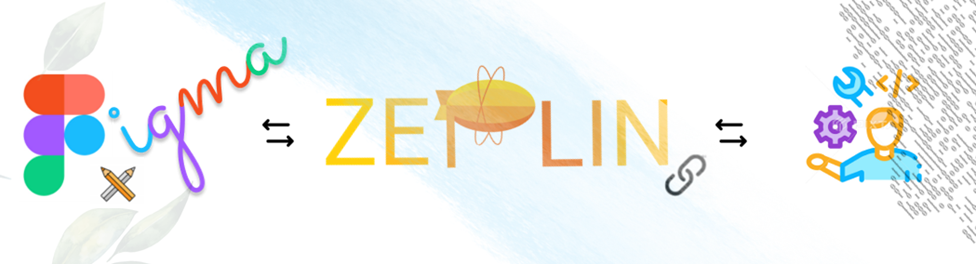
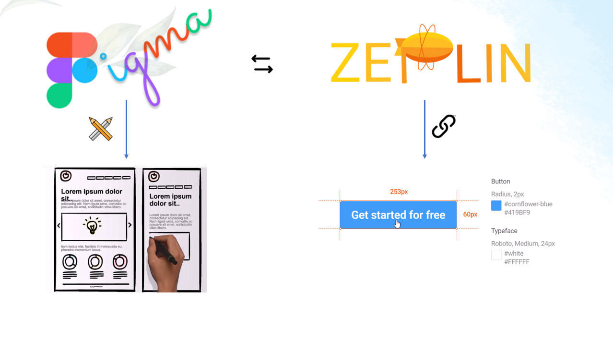

# What are Zeplin & Figma?

# Setup
Figma and Zeplin are both available as a Web- and Desktop versions.
1. Sign Up in [Figma](https://www.figma.com/)
2. Sign Up in [Zeplin](https://zeplin.io/) (_now possible with you existing Figma account_)
3. _Download the Desktop versions (recommended)_

# Create a project
1. Create a new Team (_Note: Figma Professional is free for students - don't forget to get verified - a created Team can't be updated afterwards_)
2. Projects can now be created within the created team.
3. Design files can now be created within the projects.
4. Be creative! Check the [Link Section](#links) for detailed tutorials.

# Links
 - [Get to the Figma homepage](https://www.figma.com/)  
 Note: Figma Professional is free for students - don't forget to get verified
 - [Learn Design with Figma lessons](https://www.figma.com/resources/learn-design/)  
 These lessons and exercises will help you start designing.
 - [Learn Design with Figma videos](https://www.youtube.com/playlist?list=PLXDU_eVOJTx7QHLShNqIXL1Cgbxj7HlN4)  
If you prefer to learn by watching videos instead, follow this link
 - [Get to the Zeplin homepage](https://zeplin.io/)
 - [Learn all about Zeplin with videos](https://learnux.io/course/zeplin/welcome)  
This link leads you to a Zeplin video introduction
 - [https://github.com/zeplin/connected-components-docs](https://github.com/zeplin/connected-components-docs)  
This link shows a description of how to connect components from figma to your project.
It also describes how to connect the components to specific platforms for example Angular.  

### Notes

- It will take some time to get into Figma & Zeplin. 
Be patient. The links inserted here were enough for me 
to go through the complete design and hand over process up to 
the coding of components.
- Name your components self-explanatory and with a structure (_Button/Loading/Large_)
- The code preview of the components in Zeplin is not available 
for all kind of projects. It will say "No description or code snippet." The connection, however, exists.
